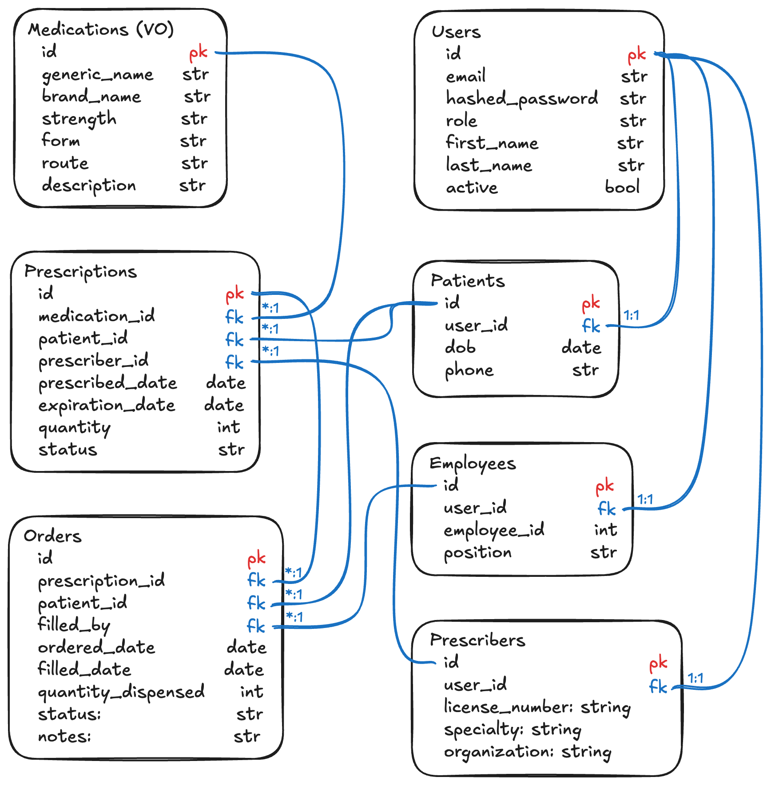

# Plannr

## Overview

Plannr is a web app for event planning that supports group creation, role-based access, recurring events, RSVPs with custom surveys, polls, file sharing, and calendar sync. Includes engagement tools like reminders, event feeds, and post-event photo sharing.

<br>

## Purpose

### 1. Deepen My Understanding of Full-Stack Development

This project is meant to go beyond just getting things to work. It is designed to help me develop a more complete understanding of how each part of a full-stack application fits together. Areas of focus include:

- Relational database design and data modeling
- ORM usage patterns and tradeoffs
- Backend architecture and API design
- Authentication and authorization
- Infrastructure and deployment (Docker, CI/CD pipelines)
- Frontend architecture and component state management
- UI responsiveness and accessibility
- Performance optimization at all levels

<br>

### 2. Compare Multiple Tech Stacks Through Real Implementation

The second goal of this project is to rebuild the same application using different technology stacks. This will help me better understand the strengths and limitations of each tool by implementing the same features across:

- Frontend frameworks (React, Vue, Svelte)
- Backend frameworks (Django, FastAPI, Node/Express)
- ORM libraries (Django ORM, SQLAlchemy, Prisma)
- Additional tools such as form libraries, validation utilities, and deployment methods

<br>

## Tech Stack

### Stack 1 

- **Backend:** FastAPI, SQLAlchemy, Alembic, pytest
- **Database:** PostgreSQL
- **Frontend:** Angular, Tailwind CSS
- **Containerization:** Docker
- **Standard folders:**
  - `api/` (backend)
  - `ui/` (frontend)
  - `db/` (migrations/scripts)
  - `docker/` (Docker configs)
  - `tests/` (tests)

### Stack 2 

- **Backend:** Django, Django ORM, Celery, pytest
- **Database:** MySQL
- **Frontend:** Angular, Tailwind CSS
- **Containerization:** Docker
- **Standard folders:**
  - `backend/` (backend)
  - `frontend/` (frontend)
  - `db/` (migrations/scripts)
  - `docker/` (Docker configs)
  - `tests/` (tests)

<br>

## Getting Started

Follow these steps to set up and run The Pharmacy Farm locally.

1. **Clone the Repository**

   ```sh
   git clone <your-repo-url>
   cd pharm-farm
   ```

2. **Configure Environment Variables**

   - In the project root, create a `.env` file.
   - Add the following (replace with your values):
     ```
     POSTGRES_USER=your_user
     POSTGRES_PASSWORD=your_password
     POSTGRES_DB=your_db
     POSTGRES_PORT=5432
     DATABASE_URL=postgresql://your_user:your_password@db:5432/your_db
     JWT_SECRET_KEY=your_jwt_secret
     ```

3. **Install and Start Docker**

   - Ensure Docker Desktop is running (macOS/Windows).
   - On Linux, start Docker with:
     ```sh
     sudo systemctl start docker
     ```

4. **Build and Run the Application**

   ```sh
   docker-compose build
   docker-compose up
   ```

5. **Access the API**
   - Once running, visit: [http://localhost:9000/docs](http://localhost:9000/docs) for the FastAPI interactive docs.

<br>

## Domain Driven Design

This project uses Domain Driven Design principles and is defined here.


<br>

## Developers

**Eric Warren**
[LinkedIn](https://www.linkedin.com/in/ericswarren/) | [GitHub](https://github.com/eswarren18)

<br>
